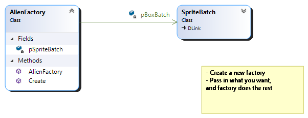
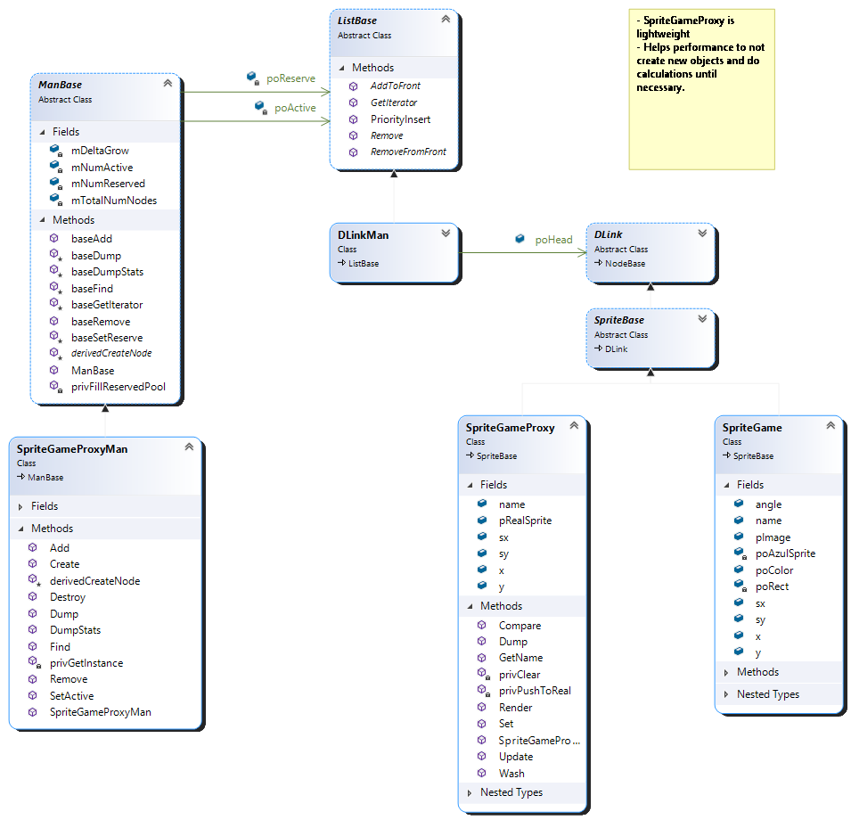
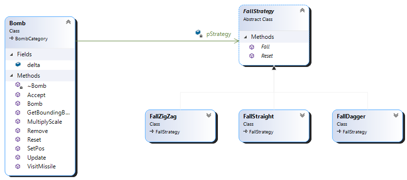
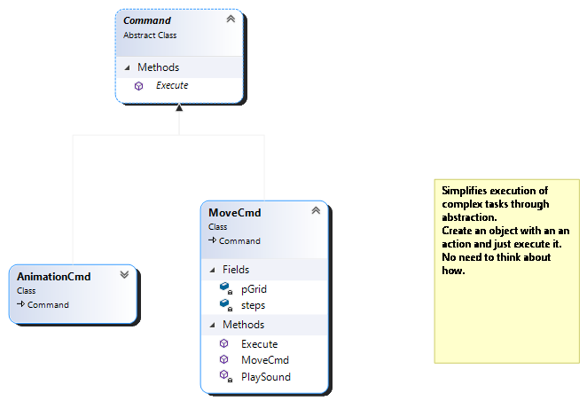
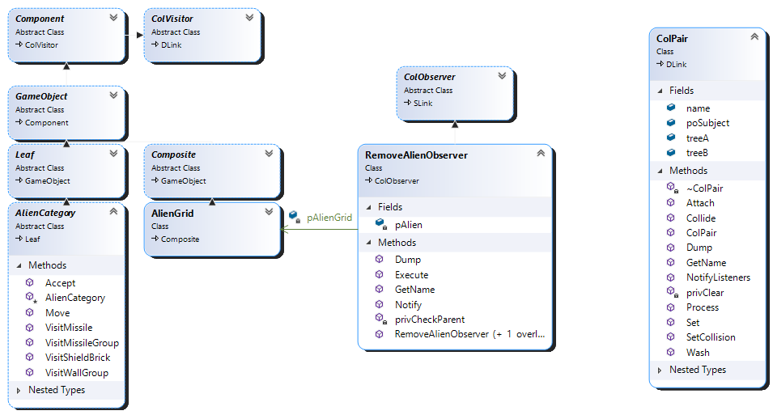
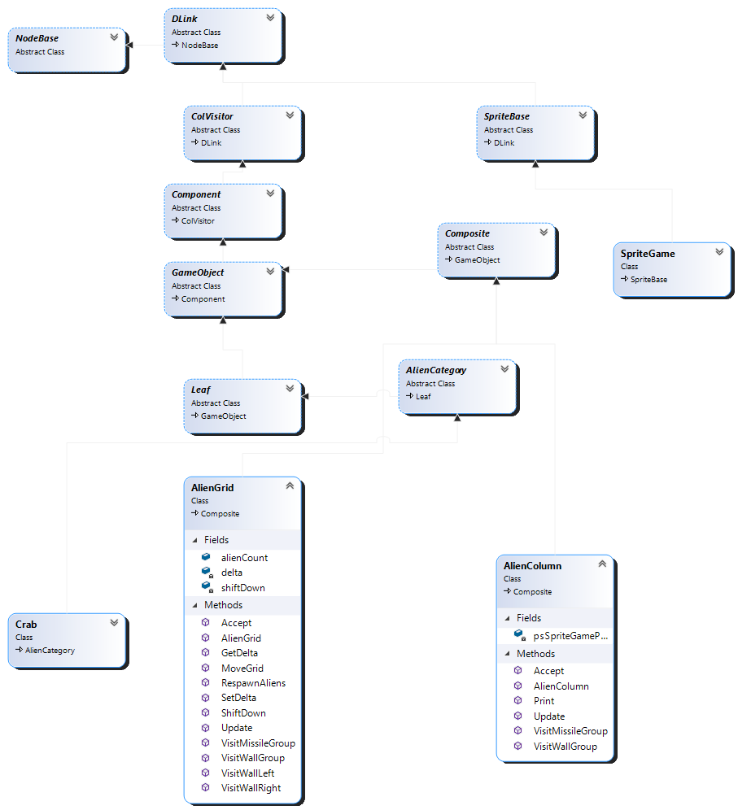
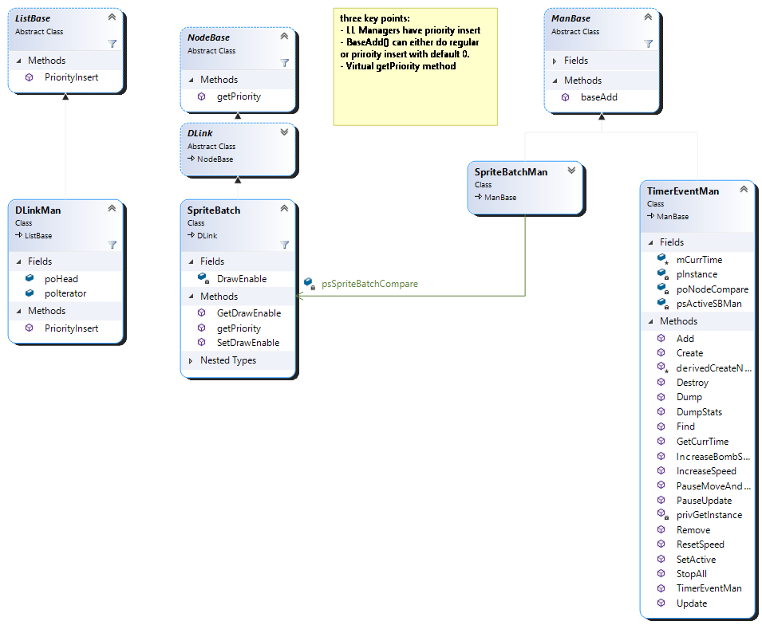
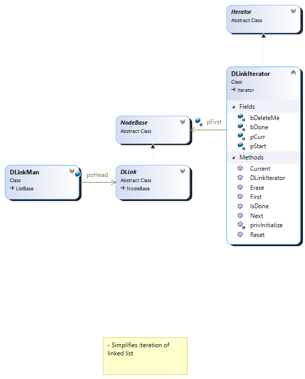
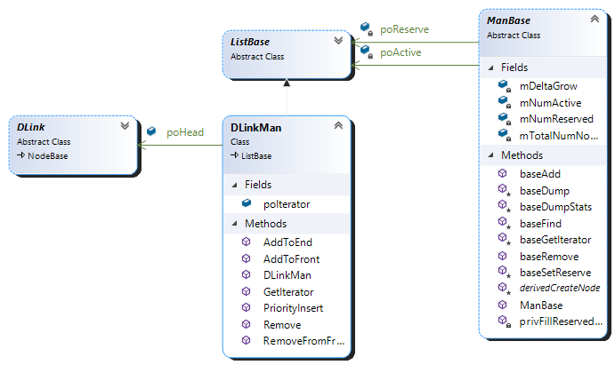

 

# **Space Invaders Design Patterns**

  
## **Factory Pattern**

 

**A. The Problem and Solution:**

In the game, there are a multitude of different highly related objects that follow similar

creational procedures. By creating new objects in a host of different classes, we

increase coupling and the complexity of the program overall. The solution is to have a

static class that handles the creation of classes that we will need to instantiate in many

different places.

**B. Pattern description:**

The factory pattern is a creational design pattern that simplifies the creation of new

objects. Rather than using the constructor of the specific class you want to create, you

can create a factory for related classes and “ask” the factory for to return an object by

name.

**C. Key Object Oriented mechanics:**

 

Factory classes are typically static and can thus be used in any class. Although I did not

do this in my program, they can inherit from abstract factories if the program is going to

be using multiple factories and we want to create a template. By using a factory class,

the game code can be simplified and made more modular, as each type of enemy can

be encapsulated in its own class. This makes it easier to modify or add new enemy

types without affecting the rest of the game code. Additionally, the factory pattern

promotes code reuse, as the same factory class can be used to create multiple

instances of the same type of object.

**D. How it is used in Space Invaders:**

In the context of my version of Space Invaders, the factory pattern was used to create

Aliens and shields — both their composite and leaf correlates. Instead of creating

individual enemy objects directly in the game code, the factory pattern was used to

create a factory class that was responsible for the creation of all aliens and shields. In

my program, I added a method in the shield factory to create all shields that are used for

each game cycle.

___

## **Proxy Pattern**

 

**A. The Problem and Solution:**

Loading all the aliens, shields, and other sprites is memory intensive and will slow down

the game. Just because the game is working on your computer rig with 64 gb of RAM

and top shelf internals does not mean it will work on a computer with only 8 gb RAM.

The solution to this problem is to create a “proxy” for sprites whose class does not need

 

to hold as much data as a regular proxy – thus decreasing the memory load for each

individual sprite.

**B. Pattern description:**

The proxy pattern is a structural design pattern that provides a surrogate or placeholder

object, which acts as a substitute for another object. The purpose of the proxy object is

to control access to the original object or to add additional functionality to it, without

changing its underlying code.

**C. Key Object Oriented mechanics:**

The proxy will inherit the same class that the real object will – in this case, the

SpriteBase class. That way, the sprite proxy can be added to the program without

disruption. They can be passed into other classes as SpriteBases, and methods that act

on the proxies coordinates, will behave properly. It is only when the objects need to be

rendered, that we need the real sprite.

**D. How it is used in Space Invaders:**

In Space Invaders, the proxy pattern is used for implementing lazy loading of game

objects. For example, each sprite in the PlayScene class is initialized before they are

ever rendered or needed. Sprites exist in reserve lists as well as the GhostMan. These

do not need to and should not be rendered. In many instances it is enough to simply

update the coordinates of the game object. There is no reason to tax the memory in this

case – we simply create the sprites as proxies and access the Azul data when its

absolutely necessary.

___

 

## **Singleton Pattern**
 

**A. The Problem and Solution:**

There should only be one instance of many different managers – for example, we do not

want or need multiple instances of a game object manager. If we had multiple, on

purpose or by accident, it could lead to issues with data inconsistencies, poor

performance, redundancy, and rendering. We also need to access these managers in

many different classes and passing these classes around is cumbersome and makes it

hard to keep track of who has access to what. The solution is to create a static class

with a private constructor that ensures *one* instance of that class.

**B. Pattern description:**

 

The singleton pattern is a creational design pattern that ensures that a class has only

one instance. It allows a global access point, meaning all classes have the ability to

access it. This pattern is useful when there is a need for a single instance of a class to

coordinate actions across the system.

**C. Key Object Oriented mechanics:**

The singleton has a private constructor to ensure that other classes are unable to

directly create an instance of it. The sole instance as well as many of its methods are

static which allows it to be globally available and usable. It also ensures thread safety,

meaning that only one instance can be created if it is implemented correctly. In the case

of my version, we used a static Create method, which ensured it was even more safe.

**D. How it is used in Space Invaders:**

The singleton pattern is used for all managers and, in my version, it is also used for the

SceneContext class. in the final product, it became a variation of the singleton pattern,

in which, we set an “active state” for each scene since each scene held different data

and needed to be rendered differently. In the case of the SceneContext, I decided to

make it a singleton so that I could have access to the current and high score throughout

the program. I needed only one context class and I also wanted to be able to adjust,

 

access, and render the score in all scenes. The easiest solution was the singleton, and

the fact that it was static made updating the score when killing aliens and accessing it

when rendering the scores, far simpler and cleaner.

___

## **State Pattern**
 

**A. The Problem and Solution:**

The problem in Space Invaders is managing the behavior of game objects that change

based on their current state. For example, one button should usually cause the cannon

to shoot, but not when that cannon has just fired. The solution is to use the state

pattern, which allows an object to change its behavior based on its internal state – that

way, we do not have to use a series of conditionals, but can simply change the behavior

based on what state object is active at the moment.

 

**B. Pattern description:**
 

The state pattern is a behavioral design pattern that enables an object to change its

behavior when its internal state changes. The pattern represents each state of the

object as a separate class, and the object switches between these classes as its state

changes. By doing so, the object's behavior changes based on what object is currently

slotted into the class controlling the behavior.

**C. Key Object Oriented mechanics:**

It creates an interface for state: the state pattern typically defines a state interface that

encapsulates the behavior of the object in a particular state. The state pattern typically

defines concrete state classes that implement the state interface and encapsulate the

behavior of the object in a particular state. It defines a context class that maintains a

reference to the current state object and delegates behavior to it. The pattern also

allows the current state to occur dynamically based on some event or condition.

**D. How it is used in Space Invaders:**

The State pattern is used in both the Context class and in the ShipMan. In the case of

the Context, there are three different states – SceneSelect, ScenePlay, and SceneOver.

The methods associated with these – initialize, entering, and leaving act on each

respective scene depending on which stage of the game that the player is on. It is also

used in the ShipMan in regards to the ship firing a missile and moving. For example,

when the ship “activates a missile,” the firing state is changed to flying so that if the

player presses spacebar again, no action is taken.

___

 

## **Strategy Pattern**

 

**A. The Problem and Solution:**

We have a class that represents a sprite that exhibits multiple behaviors based on the

sprite associated with them i.e. the Bomb class. What if we do not want to create three

different classes when their behavior is otherwise identical or what if we don’t know how

many strategies will be added? Creating a singular class that has to implement multiple

algorithms could lead to a series of conditional statements, which can lead to complex

and hard-to-maintain code. The solution is to use the strategy pattern, which allows an

object to select an algorithm dynamically from a family of algorithms at runtime.

**B. Pattern description:**

The strategy pattern is a behavioral design pattern that enables an object to select an

algorithm dynamically from a “family” of algorithms and use it to perform a specific task.

 

In this pattern, the algorithms are encapsulated in separate classes, each implementing

a common interface. The context class, e.g. the Bomb class, maintains a reference to

the current strategy object and delegates behavior to it, allowing the object to change its

behavior dynamically at runtime.

**C. Key Object Oriented mechanics:**

The strategy pattern uses an interface or abstract class for each strategy. From this,

concrete strategy classes inherit the interface to implement and encapsulate the specific

algorithm. Like with the state pattern, there is a context class that maintains a reference

to teh current strategy and delegates behavior to it. This allows dynamic behavior

changing through utilizing the algorithms defined in each concrete strategy class.

**D. How it is used in Space Invaders:**

The Bomb class uses the strategy pattern in order to determine how the bomb should

fall. There is a strategy abstract class that is inherited by the dagger, straight, and

zig-zag classes. When the bomb is created, a specific strategy is passed into it along

with the corresponding sprite. When the sprite is updated, it calls the method associated

with that strategy to determine how its coordinates should be updated specifically.

___

 

## **Command Pattern**

 

**A. The Problem and Solution:**

We have to encapsulate specific requests and we do not want them to be tied to any

specific objects or receivers since we will re-use them for a number of classes. The

solution is to use the command pattern, which separates the object that invokes a

 

command from the object that actually performs the command. So, if we want to

animate a game object, we can call it on a number of game objects in a simplified,

encapsulated manner.

**B. Pattern description:**

The command pattern is a behavioral design pattern that encapsulates a request or

command as an object, which can called by a simple method like “execute.” In this

pattern, a command object is created that contains all the information necessary to

perform a particular action, including the method to be called, the object that will

perform the method, and any parameters that the method requires. The command

object can then be passed around the system or stored in a queue.

**C. Key Object Oriented mechanics:**

The command pattern defines a common interface for all the commands. There are

then, concrete command classes that implement the command interface and

encapsulate specific actions. Then, we define a class that receives requests and

delegates them to the appropriate command object. Finally, we define a receiver class

that performs these commands that we defined. This pattern eliminates the need to

copy/paste certain algorithms into all the classes that need them - we can define the

algorithm once and let each class who needs it, use it.

**D. How it is used in Space Invaders:**

There are a number of specific and reusable actions that we need to take throughout

the runtime of the game. Among these are moving and animating sprites (swapping

images repeatedly). All of these actions need to happen at specific time intervals and

act on specific sprites. To do this, we have created a event manager that takes in

commands and calls them according to the delta time that is assigned to them. In the

case of the animation command, we give it specific images that need to be swapped

 

and in the case of the move command, we give it specific objects that need to be moved

as well as the amount that they should be moved.

___

## **Visitor Pattern**

 

**A. The Problem and Solution:**

The problem is how to efficiently calculate collisions between game objects. Sprites are

constantly coming into contact with little information on one another, but every sprite

can’t hold a reference to every other sprite. The solution is to use the visitor pattern,

which separates the collision detection algorithm from the game objects and allows for

easy addition of new collision detection algorithms without modifying the existing game

objects. It allows one object to visit another and test for overlap.

 

**B. Pattern description:**

The visitor pattern is a behavioral design pattern. It allows us to add new operations to

existing classes without modifying the classes themselves. Typically, a visitor object is

created that contains the algorithms or operations that can be performed on the objects

in the structure. Each object in the structure accepts a visitor object, which then applies

the appropriate algorithm to the object.

**C. Key Object Oriented mechanics:**

Similar to the other patterns, a visitor interface or abstract class is created that is

inherited by concrete classes that need to make use of the visitor. It helps to ensure the

open-closed principle, which, put simply, asserts that the programmer should be able to

add/extend classes without having to seriously change them.

**D. How it is used in Space Invaders:**

Collision detection is made possible by the Visitor pattern since it allows one game

object to visit another where its hitbox will be assessed to determine whether or not, a

collision has indeed occurred. I combined the UML diagram of Visitor and Observer,

since in my program, they are so closely intertwined. Once a detection occurs, it will go

on to notify the observing classes.

## **Observer Pattern**
 

**A. The Problem and Solution:**

The problem is how to notify game objects when changes occur in other objects without

tightly coupling them together. The solution is to use the observer pattern, which allows

objects to be notified of changes in other objects without needing to know the details of

the changes.

 

**B. Pattern description:**

The observer pattern is a behavioral design pattern that allows a subject object to

maintain a list of observers, and notify them automatically of any state changes. This

helps to keep things in order and on time when a program has many interrelated events

that need managing.

**C. Key Object Oriented mechanics:**

There is a subject and observer interface that allows observers to subscribe and

unsubscribe to the subject, as well as receive notifications of state changes. The

observer interface can specify an update method that will be called when these changes

occur. There is a concrete class that inherits the subject interface for specific events

that maintains a list of all observers to be notified and the observer class defines what

change should actually occur.

**D. How it is used in Space Invaders:**

It is mostly used to define what should happen when collisions occur. For example, the

RemoveShipObserver and RemoveBombObserver is called when the ship collides with

a bomb, which advances the game by either calling Game Over or by decreasing the

lives left count. It also deletes the bomb and ship sprite from the board. The visitor and

observer pattern together lets us decide which collisions are important, what classes

should be notified, and which specific actions should be taken when two pairs collide.

 
___

## **Composite Pattern**

 

**A. The Problem and Solution**

Let’s look at the structure of alien game objects. Aliens need to move in unison, and

calculations, such as collisions, need to be applied to groups of aliens. In order to

handle this requirement, we placed each alien in collections i.e. grids and columns.

 

However, the collection classes create a new problem: iterating over all the aliens on

screen becomes significantly more complex and messy. This is where the composite

pattern comes to the rescue: it allows us to organize the aliens into a tree-like structure

that is far easier to traverse.

**B. Pattern description:**

The composite pattern is a structural pattern that simplifies the usage of complex

containers by organizing group objects and ungrouped objects into a single tree-like

data structure . Without the composite pattern, iterating over an alien grid would likely

require nested loops over columns of variable size – doing these calculations gets

messy very quickly (e.g. the Amazon Truck assignment). However, with the composite

pattern, the difference between grids, columns, and aliens is abstracted away. Calling

Move() on a grid or a column, for example, will call Move() on every object inside that

grid. Each of these classes inherit the same abstract class from Component and can

therefore be treated as the same when calling Move(). If we ask to move the grid five

pixels to the right, it passes the request down the tree to the columns and subsequently,

to each leaf where it adds five to the x coordinate of each sprite. When a method is

 

called in a composite class, the “real” work is done in the leaf classes. What is

happening under the hood when Move() is called on a column vs. a leaf is completely

different, but the client does need to know this.

**C. Key Object Oriented mechanics:**

This pattern uses polymorphism since both the Composite and Leaf classes inherit from

Component. if you call Move() on a component, the object’s type determines which

action should be taken. If the component is of type Composite, Move() will iterate

through its children, and if the composite’s child is another composite object, it repeats

this process. However, if the object is a leaf, Move() will actually “do the work” by

updating the coordinates of its sprite proxy. This pattern also abides by the open/closed

principle since it allows us to add new object types without breaking existing code. As

long as the new object inherits the component interface, it should be compatible with

existing code.

**D. How it is used in Space Invaders:**

In my version of Space Invaders, GameObjects are the “Components”, AlienGrids and

AlienColumns are the “Composites,” and AlienBases are the “Leaves.” Let’s briefly step

through the control flow of Move(). The method is first called in the Alien Grid class

where it asks the grid to move a certain number of pixels. First, the composite Move()

accesses a singleton iterator for the purpose of stepping through each child in recursive

order. The iterator returns objects of type Component and determines through

polymorphism whether it goes one level deeper or moves to the next child to update the

coordinates.

In Space Invaders, this pattern is enhanced by the null object pattern.

Composites inherit from GameObject class whose constructor takes SpriteGame.Name

and GameObject.Name. Since Composite objects are merely collection classes and not

actually being drawn, we want to initialize these fields as null objects. Therefore, we can

indiscriminately send them through the “assembly line” as if they were a GameObject

 

holding a sprite. This allows us to maintain their coordinates and other data as well as

avoiding edge cases in my program. In summation, the composite pattern allows us to

avoid the complexity of calling methods in a program that contains multiple groups and

subgroups.

___

## **Template Pattern**
 

**A. The Problem and Solution**

The problem is how to define a common structure for managers to follow while still

allowing them to have their unique behaviors. The solution is to use the template

pattern, which defines a common template for game objects to follow while allowing for

variations in behavior through method overriding and adding new ones.

**B. Pattern description:**

 

The template pattern is a behavioral design pattern. It defines a template or skeleton as

an interface that child classes can inherit and borrow functionality from. Subclasses can

override parts of its parent without changing the structure.

**C. Key Object Oriented mechanics:**

The interface or abstract method defines the template and each child inherits from that

template whilst adding its own variation. The template can provide default behavior that

each children may choose whether it needs to override. The pattern is another example

of a pattern that reduces the need for copy/pasting. When there are classes that are

similar, but differ in some ways, this pattern is a good option.

**D. How it is used in Space Invaders**

The most salient usage of the pattern is with the managers and linked list nodes. The

ManBase class provides methods, such as Create, Add, Destroy, and Find to all

managers in the program. Each manager will be adding to different types of linked lists

that are used for different functionalities e.g. GameObjectMan, SpriteGameProxyMan,

etc. Each manager overrides and adds new methods to suit the needs of its specific

 

goal. For example, the SoundNodeMan, has a PlaySound() method, which finds a

specific sound node and plays the audio from the sound engine.

## **Priority Queue Pattern**

 
 

**A. The Problem and Solution:**

The problem is that we want a linked list to be in sorted order based on a particular

priority and stay in that order when inserting or removing nodes. We do not want to

have to re-sort the list every time this happens, however. The solution is to use the

priority queue pattern, which stores the game objects in a data structure that

automatically maintains the order based on their priority.

**B. Pattern description:**

The priority queue pattern is a data structure that maintains a queue of elements with

assigned priorities, and keeps the elements in that order based on their priority. The

pattern requires a definition of priority, a data structure to store the elements, and an

element class to represent the data and its associated priority.

**C. Key Object Oriented mechanics:**

The list base defines a priority field that multiple nodes can utilize for different purposes

– it does not have to just be based on timing, but can be determined by some abstract

value, such as rendering order.

 

**D. How it is used in Space Invaders:**

We have a series of commands in a linked list that need to be called at specific times.

However, when we reach a trigger time that is higher than the current, it is incredibly

inefficient to have to loop through the entire list when we know we are not going to

execute any of the commands. Unless the linked list is in ascending order, we cannot

break the loop while ensuring that we have triggered all commands that need to be

triggered. Priority Queue allows us to sort the list so that we can optimize the game in

this way.

## **Iterator Pattern**

 

**A. The Problem and Solution:**

The problem is that iterating over linked lists is painful and lengthy, and especially so

when you are doing so often and working with different data structures. The solution is

the Iterator Pattern, which provides a standardized and simple way to traverse lists

regardless of their underlying data structure.

**B. Pattern description:**

The Iterator Pattern is a design pattern that allows for accessing elements of a list

sequentially without knowledge of its underlying data structure.

**C. Key Object Oriented mechanics:**

The pattern involves creating an Iterator interface that defines methods for traversing

through a collection. Concrete iterators can inherit and implement for their specific data

structure. The pattern, when possible, can decouple the traversal algorithm from its data

structures so that it can be used in more contexts.

**D. How it is used in Space Invaders:**

The iterator pattern is used for traversing all the different linked lists – of which there are

quite a few. We added specific methods to it, such as IsDone(), Next(), and First(). It is

perhaps most useful in the case of the composite iterator which is quite difficult to

traverse.

 

## **Object Pooling**

 

**A. The Problem and Solution:**

The problem is that game objects are being created and deleted constantly and that is

costly on processing time and memory – we don’t want the game to be slowed down

every time a missile is created for example. The solution is to use the Object Pooling

pattern so that no new object creation goes to waste and uninitialized reserve objects

are always available to grab when needed.

**B. Pattern description:**

The Object Pooling Pattern is a design pattern that involves creating a pool of objects

that can be reused. There is an active and reserve list that hold currently used objects

 

and a pool of objects to pull from. When an object is needed, it is retrieved from the

reserve pool, and when it is no longer needed, it is returned to the reserve pool. This

way, the objects can be reused instead of being created and destroyed every time. It’s

like having benched players in a game that can be sent in whenever needed.

**C. Key Object Oriented mechanics:**

There is not necessarily any difference in the data structures that are behind the active

and reserve lists. They are owned by composition by some kind of manager that can do

the creation, deletion, and grabbing from the reserve list. The object pool encapsulates

the creation, initialization, and management of objects in a separate module. The

objects in the pool are hidden from the client, and the client only interacts with the

Object Pool Manager to retrieve and return objects to the pool.

**D. How it is used in Space Invaders:**

This pattern is used in nearly every manager that must maintain a list of objects.

Whenever Add() is called, it is assigning fields to an object that has already been

created and/or possibly used on the reserve list. For example, when an alien is hit by a

missile, its sprite is washed (aka its distinct data is deleted) and it goes onto the reserve

list for the next time that a sprite of any kind is needed. The same is true of fonts,

sound, image, and many other types of nodes.

